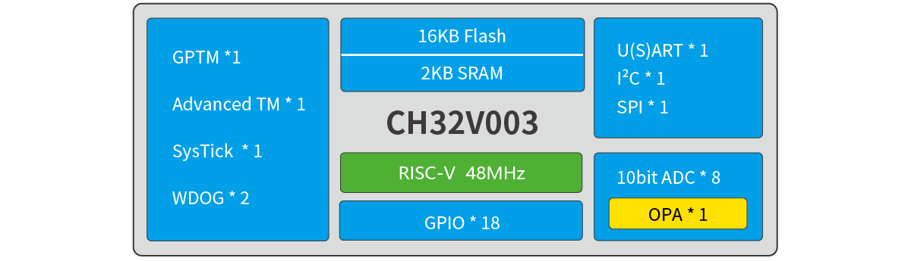
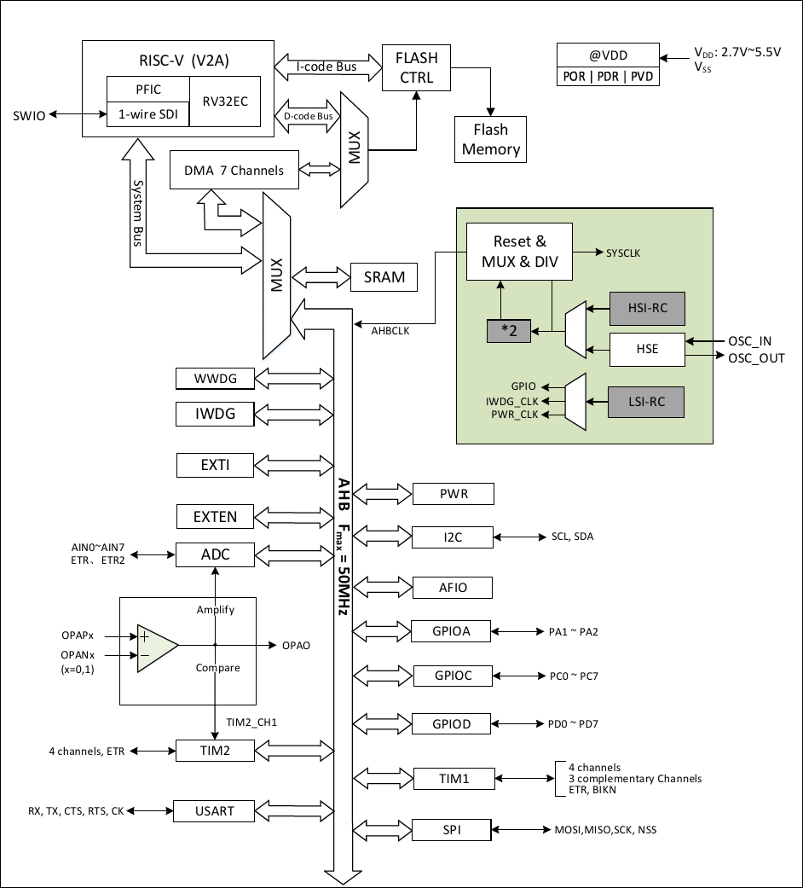

# CH32V003

| SWCLK | SWDIO | TX1 | RX1  |
|-------|-------|-----|------|
|       | PD1   | PD5 | PD6  |

## Official Site
- https://www.wch-ic.com/products/CH32V003.html
- https://www.wch.cn/products/CH32V003.html

## System Block Diagram

## System Architecture

## Comparison

## Pin Definitions
