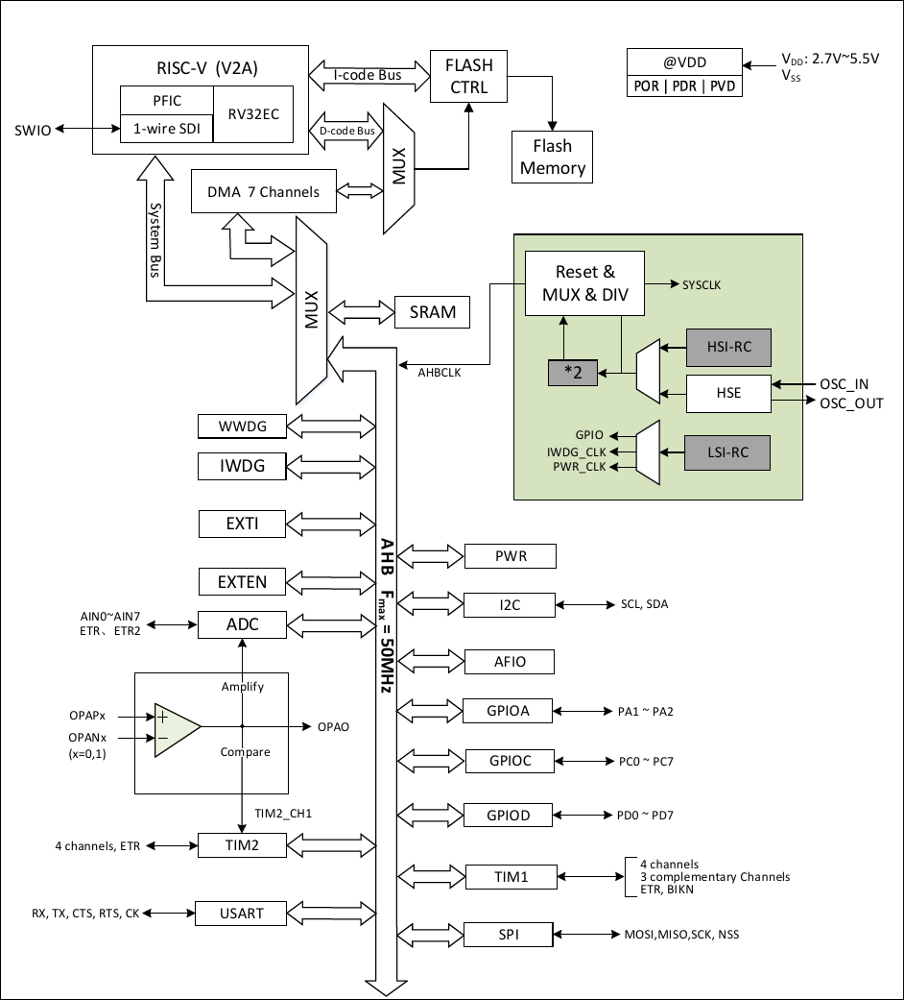

# CH32V003

| SWCLK | SWDIO | TX1 | RX1  |
|-------|-------|-----|------|
|       | PD1   | PD5 | PD6  |

## Official Site
- https://www.wch-ic.com/products/CH32V003.html
- https://www.wch.cn/products/CH32V003.html

## Datasheet
- en [[CH32V003DS0.PDF](https://ch32-riscv-ug.github.io/CH32V003/datasheet_en/CH32V003DS0.PDF)] [[CH32V003RM.PDF](https://ch32-riscv-ug.github.io/CH32V003/datasheet_en/CH32V003RM.PDF)]
- zh [[CH32V003DS0.PDF](https://ch32-riscv-ug.github.io/CH32V003/datasheet_zh/CH32V003DS0.PDF)] [[CH32V003RM.PDF](https://ch32-riscv-ug.github.io/CH32V003/datasheet_zh/CH32V003RM.PDF)]

## System Block Diagram

### CH32V003

## GPIO Definitions
<table>
    <thead>
        <tr>
            <th>CH32V003&#8203;A4M6&#8203;(SOP16)</th>
            <th>CH32V003&#8203;F4P6&#8203;(TSSOP20)</th>
            <th>CH32V003&#8203;F4U6&#8203;(QFN20)</th>
            <th>CH32V003&#8203;J4M6&#8203;(SOP8)</th>
            <th>Pin name</th>
            <th>Pin type</th>
            <th>Main function&#8203;(after reset)</th>
            <th>Note</th>
        </tr>
    </thead>
    <tbody align="center">
        <tr>
            <td>12</td>
            <td>5</td>
            <td>2</td>
            <td>1</td>
            <td>PA1</td>
            <td>I/O/A</td>
            <td>PA1</td>
            <td>not available</td>
        </tr>
        <tr>
            <td>13</td>
            <td>6</td>
            <td>3</td>
            <td>3</td>
            <td>PA2</td>
            <td>I/O/A</td>
            <td>PA2</td>
            <td>not available</td>
        </tr>
        <tr>
            <td>16</td>
            <td>10</td>
            <td>7</td>
            <td>-</td>
            <td>PC0</td>
            <td>I/O</td>
            <td>PC0</td>
            <td></td>
        </tr>
        <tr>
            <td>1</td>
            <td>11</td>
            <td>8</td>
            <td>5</td>
            <td>PC1</td>
            <td>I/O/FT</td>
            <td>PC1</td>
            <td></td>
        </tr>
        <tr>
            <td>2</td>
            <td>12</td>
            <td>9</td>
            <td>6</td>
            <td>PC2</td>
            <td>I/O/FT</td>
            <td>PC2</td>
            <td></td>
        </tr>
        <tr>
            <td>3</td>
            <td>13</td>
            <td>10</td>
            <td>-</td>
            <td>PC3</td>
            <td>I/O</td>
            <td>PC3</td>
            <td></td>
        </tr>
        <tr>
            <td>4</td>
            <td>14</td>
            <td>11</td>
            <td>7</td>
            <td>PC4</td>
            <td>I/O/A</td>
            <td>PC4</td>
            <td></td>
        </tr>
        <tr>
            <td>-</td>
            <td>15</td>
            <td>12</td>
            <td>-</td>
            <td>PC5</td>
            <td>I/O/FT</td>
            <td>PC5</td>
            <td></td>
        </tr>
        <tr>
            <td>5</td>
            <td>16</td>
            <td>13</td>
            <td>-</td>
            <td>PC6</td>
            <td>I/O/FT</td>
            <td>PC6</td>
            <td></td>
        </tr>
        <tr>
            <td>6</td>
            <td>17</td>
            <td>14</td>
            <td>-</td>
            <td>PC7</td>
            <td>I/O</td>
            <td>PC7</td>
            <td></td>
        </tr>
        <tr>
            <td>-</td>
            <td>8</td>
            <td>5</td>
            <td>-</td>
            <td>PD0</td>
            <td>I/O/A</td>
            <td>PD0</td>
            <td></td>
        </tr>
        <tr>
            <td>7</td>
            <td>18</td>
            <td>15</td>
            <td>8</td>
            <td>PD1</td>
            <td>I/O/A</td>
            <td>PD1</td>
            <td>SWDIO</td>
        </tr>
        <tr>
            <td>-</td>
            <td>19</td>
            <td>16</td>
            <td>-</td>
            <td>PD2</td>
            <td>I/O/A</td>
            <td>PD2</td>
            <td></td>
        </tr>
        <tr>
            <td>-</td>
            <td>20</td>
            <td>17</td>
            <td>-</td>
            <td>PD3</td>
            <td>I/O/A</td>
            <td>PD3</td>
            <td></td>
        </tr>
        <tr>
            <td>8</td>
            <td>1</td>
            <td>18</td>
            <td>8</td>
            <td>PD4</td>
            <td>I/O/A</td>
            <td>PD4</td>
            <td></td>
        </tr>
        <tr>
            <td>9</td>
            <td>2</td>
            <td>19</td>
            <td>8</td>
            <td>PD5</td>
            <td>I/O/A</td>
            <td>PD5</td>
            <td>TX1</td>
        </tr>
        <tr>
            <td>10</td>
            <td>3</td>
            <td>20</td>
            <td>1</td>
            <td>PD6</td>
            <td>I/O/A</td>
            <td>PD6</td>
            <td>RX1</td>
        </tr>
        <tr>
            <td>11</td>
            <td>4</td>
            <td>1</td>
            <td>-</td>
            <td>PD7</td>
            <td>I/O/A</td>
            <td>PD7</td>
            <td></td>
        </tr>
    </tbody>
</table>

## System Architecture

